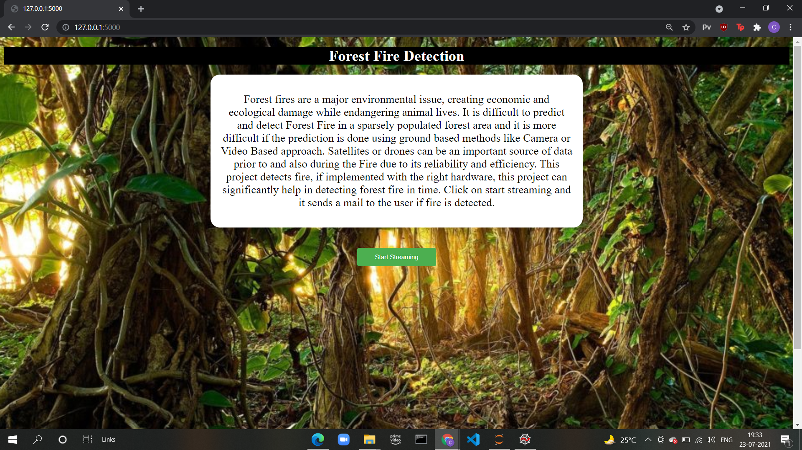
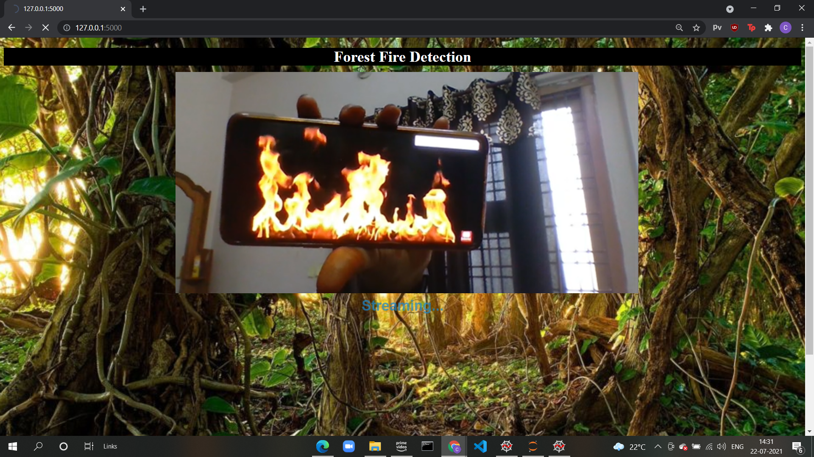
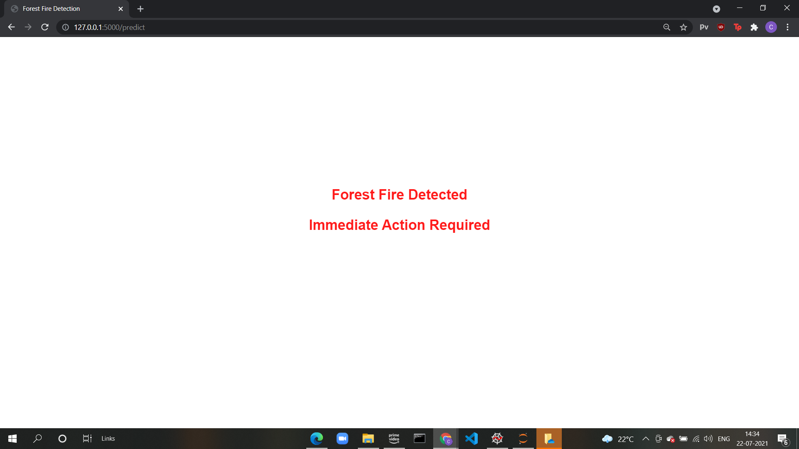
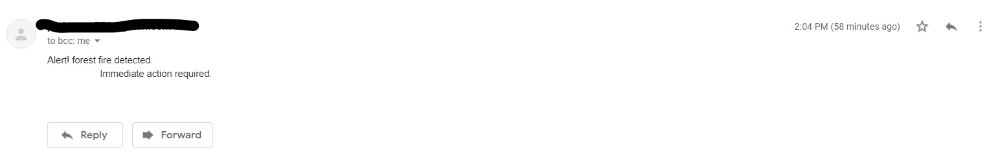

# Forest_Fire_Detection
Forest fires are a major environmental issue, creating economic and ecological damage while endangering animal lives. It is difficult to predict and detect Forest Fire in a sparsely populated forest area and it is more difficult if the prediction is done using ground based methods like camera or video based approach. Satellites or drones can be an important source of data prior to and also during the fire due to their reliability and efficiency. This project detects fire, if implemented with the right hardware, this can significantly help in saving time during a forest fire. 
  

  
After clicking start streaming, the webcam will turn on.
  

  
You'll get redirected to a new page with a warning if fire is detected.
  

  
A mail will be sent to the user about the fire.
  

